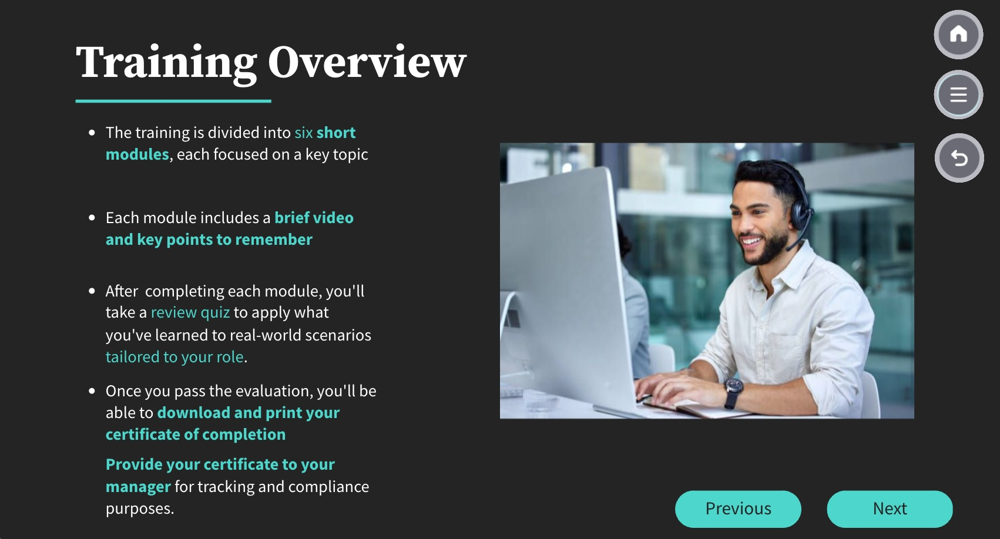

# PCI-DSS Security Awareness Training

## Project Overview

## 🔗 View the Training

[Click here to view the interactive PCI-DSS Awareness Training](https://view.genially.com/67e0550f8760193b2b0d35d5)

This security awareness training was developed as part of a group project in a cybersecurity project management course. The scenario focused on a **fictional small convenience store** aiming to improve employee awareness around **PCI-DSS compliance**.

The fictional business included roles such as a manager, front-line cashiers, and a part-time IT consultant. Its technology environment included a **POS system**, **Wi-Fi**, **contactless payments**, **online ordering**, and an **office computer/printer**. Key risks identified were:

- Weak passwords
- Phishing attacks
- Unsecured Wi-Fi
- Outdated software
- Card skimming at the point of sale

We used **Genially** as the training platform. Our team gathered resources from a variety of sources, created original content, and structured the training into role-specific modules covering:

- Password hygiene
- Phishing awareness
- Secure payment practices
- Wi-Fi security

We incorporated **awareness training best practices** with an emphasis on:

- Role relevance
- Multiple learning styles
- Engaging, interactive content
- Certificate of completion (for PCI-DSS training documentation)

Given the fictional client's limited budget, the training was designed to be **modular**, **internet-based**, and **easily updatable** to adapt to evolving compliance requirements.

> **Note:** All content, branding, and examples are fictional and used for educational purposes only.

## What I Learned

This project gave me hands-on experience with:

- Applying PCI-DSS controls in a real-world context
- Designing training that’s clear, role-specific, and accessible
- Using Genially to build modular, flexible awareness content
- Managing a project from objective to delivery, including:
  - Defining scope and soliciting training requirements
  - Identifying and mitigating project risks
  - Coordinating stakeholder input and feedback
  - Using project scheduling tools (e.g., TeamGantt)
  - Delivering a client-facing presentation of the final product
